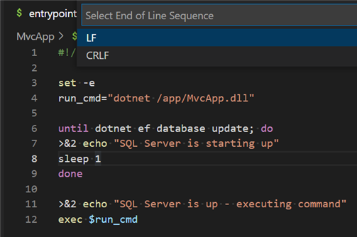

# MvcApp

Asp.Net Core Mvc based Web application with EF and MSSQL. The Docker Image was shared in the [DockerHuB](https://hub.docker.com/r/weiyao666/mvcwebapp), you could run it by this [docker-compose-mvcmssql.yml](https://github.com/Victor-Yao/TechTalkDemo/blob/main/DockerComposeSample/docker-compose-MvcMSSql.yml) without this project.

## Prerequisites

- [.NET SDK](https://dotnet.microsoft.com/download) version 6.0 or above

  ```bash
  # determine dotnet version
  dotnet --version
  ```
- [Docker](https://docs.docker.com/get-docker/) latest

## Build and Run this project on your local machine.
- Clone the repository

    ```bash
    git clone https://github.com/Microsoft/botbuilder-samples.git
    ```

- Run following two dotnet cmdlets to create a self-signed asp.net certificate from a terminal

    ```bash
    dotnet dev-certs https -ep ./cert/aspnetapp.pfx -p 123
    dotnet dev-certs https --trust
    ```

- Ensure entrypoint.sh is using Unix EOL, LF. 


- Build & start up services

  ```bash
  # Run as detached and wait to compele
  docker compose up -d --wait

  #Or Run it with complete output
  docker compose up
  ```