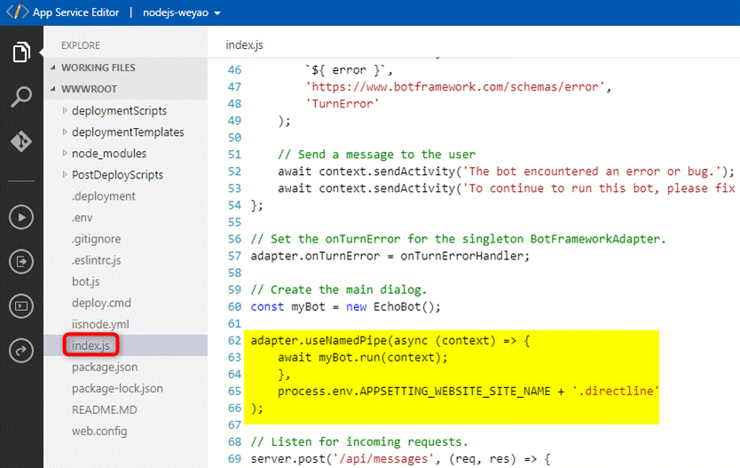
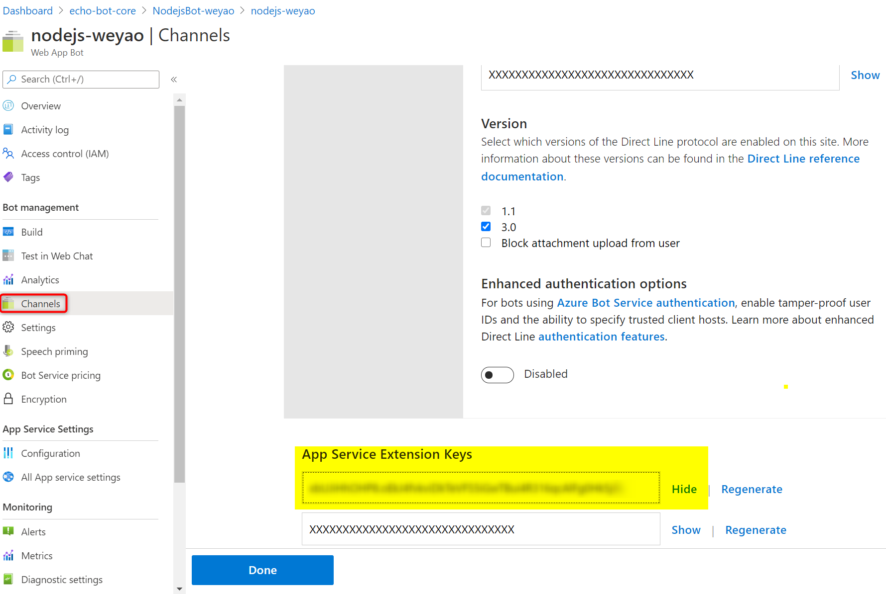
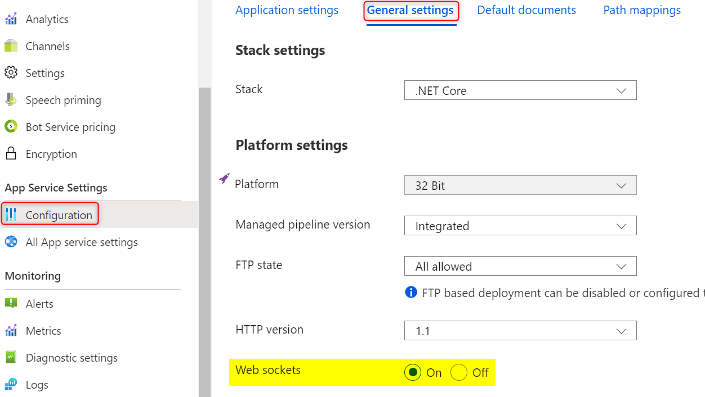

# Sample - enable Direct-Line app service extension in Nodejs bot service

## Description

This sample refers [Direct Line App Service Extension protocol](https://docs.microsoft.com/zh-tw/azure/bot-service/bot-service-channel-directline-extension-node-bot?view=azure-bot-service-4.0) to enable DL ASE and run it in WebChat.

## How to enable DL ASE

1. ### Changing in Nodejs Project

      
      

1. ### Changing in Portal

    - Enable direct-line channel. Then reval and copy "App Service Extension Keys".
        

    - Open "Configuration" in app sergice settings
      New "DirectLineExtensionKey" under Application Settings and assign "App Service Extension Keys" to value.
        

    - Make sure websockets is on under general settings
        

1. ### Test DL-ASE if it's actived

    Browser https://<your_appService>.azurewebsites.net/.bot and confirm whether the result is good as below,  
{"v":"123","k":true,"ib":true,"ob":true,"initialized":true}  

- If "ib" and "ob" are false, the possible cause is the bot service is not wake up. You can chat it via test in webchat and again.  
- If "k" or "initialized" is false, please check [this sections](https://docs.microsoft.com/en-us/azure/bot-service/bot-service-channel-directline-extension-node-bot?view=azure-bot-service-4.0#confirm-direct-line-app-extension-and-the-bot-are-configured)

## How to use DL-ASE in the web page chat

- Fetch your DL-ASE token

    ```js
    const res = await fetch('https://<your_appService>.azurewebsites.net/.bot/v3/directline/tokens/generate', {
            method: 'POST',
            headers: {
              'Authorization': 'Bearer <your directline secret key>'
            }
          });

          const { token } = await res.json();
    ```

- Render webchat adapter with Direct-Line ASE token

    ```js
    window.WebChat.renderWebChat(
        {
          directLine: await window.WebChat.createDirectLineAppServiceExtension({
            domain: 'https://<your_appService>.azurewebsites.net/.bot/v3/directline',
            token
          })
        },
        document.getElementById('webchat')
      );
      ```

The completed code is in index.html.

## How to run sample code

1. clone this project  
1. Navigate to `/BotServiceSamples/nodejs-bot/echobot-directline-ase/` in command line  
1. Run `npx serve`  
1. Browse to http://localhost:5000/